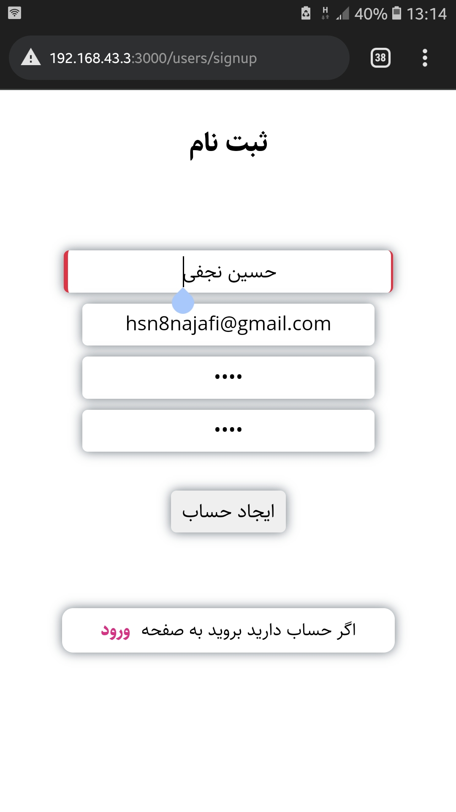
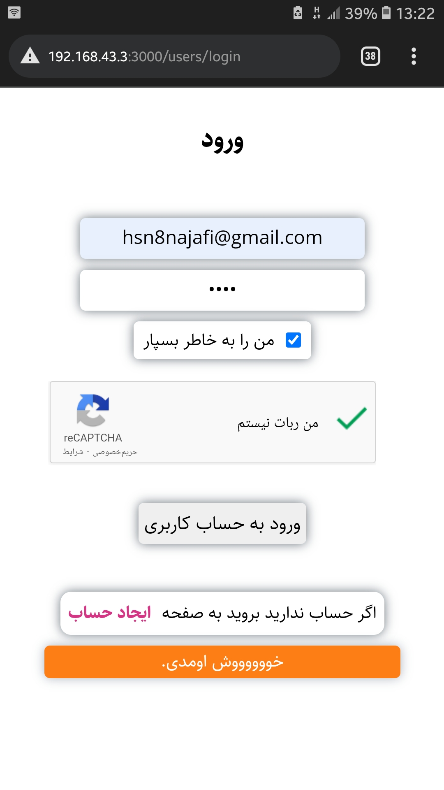
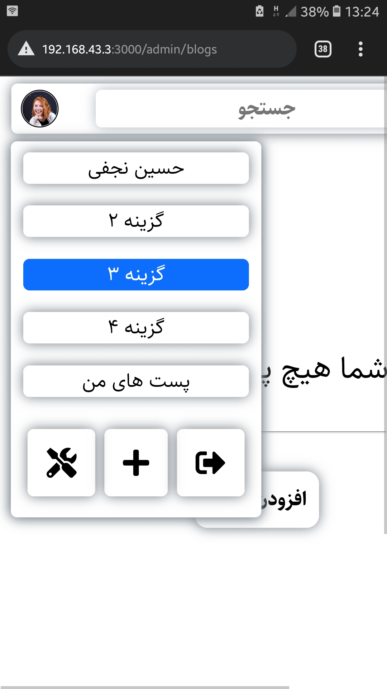
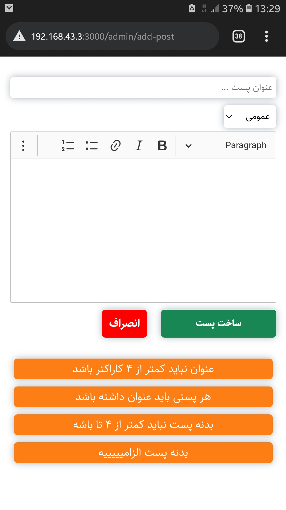
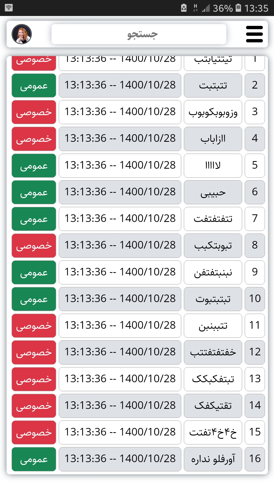
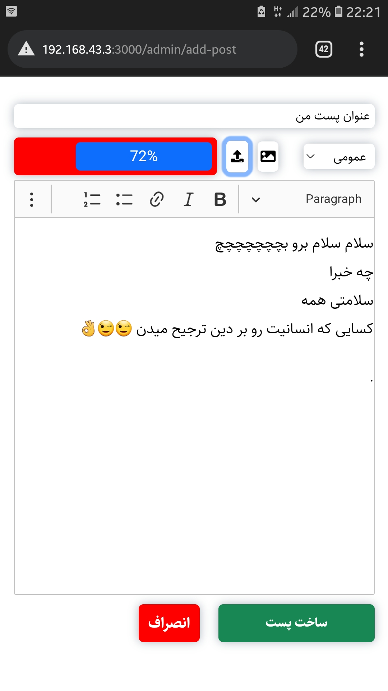

# weblog

### Weblog - Express.js

```
vi ./.env
```

```
yarn
```

```
npm run tsc
```

```
npm run sass
```

```
npm start
```

```
npm run dev
```

### ScreenShots

<table>
  <tr>
    <td></td>
    <td></td>
    <td></td>
  </tr>
  <tr>
    <td></td>
    <td></td>
    <td></td>
  </tr>
</table>
